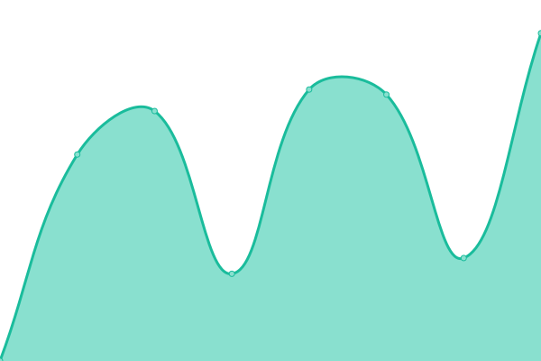

# [📈 Live Status](https://upptime.github.io/upptime): <!--live status--> **🟩 All systems operational**

This repository contains the open-source uptime monitor and status page for [Upptime](https://upptime.js.org), powered by [Upptime](https://github.com/upptime/upptime).

With [Upptime](https://upptime.js.org), you can get your own unlimited and free uptime monitor and status page, powered entirely by a GitHub repository. We use [Issues](https://github.com/upptime/upptime/issues) as incident reports, [Actions](https://github.com/Deuris117/upptime/actions) as uptime monitors, and [Pages](https://upptime.github.io/upptime) for the status page.

<!--start: status pages-->
<!-- This summary is generated by Upptime (https://github.com/upptime/upptime) -->
<!-- Do not edit this manually, your changes will be overwritten -->
<!-- prettier-ignore -->
| URL | Status | History | Response Time | Uptime |
| --- | ------ | ------- | ------------- | ------ |
|  [Agencia Zentella](https://agenciazentella.com) | 🟩 Up | [agencia-zentella.yml](https://github.com/Deuris117/upptime/commits/HEAD/history/agencia-zentella.yml) | 

 1940ms
     
 | 

<a href="https://Deuris117.github.io/upptime/history/agencia-zentella">100.00%</a>
    

|  [Widook](https://widookgroup.com) | 🟩 Up | [widook.yml](https://github.com/Deuris117/upptime/commits/HEAD/history/widook.yml) | 

 571ms
     
 | 

<a href="https://Deuris117.github.io/upptime/history/widook">100.00%</a>
    

|  [Larimarca](http://larimarca.com) | 🟩 Up | [larimarca.yml](https://github.com/Deuris117/upptime/commits/HEAD/history/larimarca.yml) | 

 1554ms
     
 | 

<a href="https://Deuris117.github.io/upptime/history/larimarca">100.00%</a>
    

|  [Tu Inmueble RD](https://tuinmuebleperfectord.com) | 🟩 Up | [tu-inmueble-rd.yml](https://github.com/Deuris117/upptime/commits/HEAD/history/tu-inmueble-rd.yml) | 

 841ms
     
 | 

<a href="https://Deuris117.github.io/upptime/history/tu-inmueble-rd">100.00%</a>
    

<!--end: status pages-->

[**Visit our status website →**](https://upptime.github.io/upptime)

## 📄 License

- Powered by: [Upptime](https://github.com/upptime/upptime)
- Code: [MIT](./LICENSE) © [Upptime](https://upptime.js.org)
- Data in the `./history` directory: [Open Database License](https://opendatacommons.org/licenses/odbl/1-0/)
